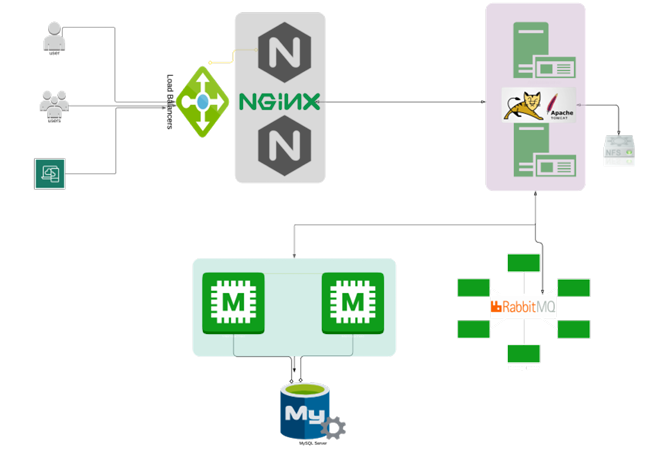

# 🚀 StackCraft – Automated Multi-Tier Web Application Setup

StackCraft is an automated, production-like multi-tier web application environment built using **Vagrant**, **VirtualBox**, and provisioning scripts.  
It sets up a complete web application stack - including **Nginx**, **Tomcat**, **MySQL**, **Memcached**, and **RabbitMQ** - each running on separate virtual machines and configured to work together seamlessly.

This project serves as a hands-on **DevOps lab** designed to practice infrastructure automation, service configuration, and end-to-end stack deployment on a local machine.

---

## 📌 Project Overview

StackCraft automates the provisioning and configuration of a social-network-style Java web application.  
It simulates a real industry-grade architecture where multiple services collaboratively deliver the application experience.

**Services included:**

- **Nginx** - Load balancer and reverse proxy  
- **Tomcat** - Java web application server  
- **MySQL** - Relational database for user data  
- **Memcached** - Database caching layer  
- **RabbitMQ** - Message broker  
- **Shared storage (optional)** - NFS for centralized file storage  

---

## 🎯 Key Features

- Fully automated VM provisioning using Vagrant  
- Multi-VM architecture (Load Balancer, App Server, DB Server, Cache Server, MQ Server)  
- Automated installation & configuration of all services  
- End-to-end deployment of a Java WAR application  
- Local lab setup that can be recreated anytime  
- Excellent for practicing DevOps concepts like IaC, provisioning, and service orchestration  

---

## ⚙️ Tools Used

- **Vagrant**  
- **VirtualBox**  
- **Git Bash / Terminal**  
- **Shell Scripts**  
- **Java (WAR application)**  
- **Linux (Ubuntu/CentOS)**  

## 🧩 Learning Outcomes

**By working with StackCraft, you will learn to:**
- Automate VM provisioning
- Configure multiple services via scripts
- Understand multi-tier architectures
- Deploy Java applications
- Troubleshoot distributed systems
- Build repeatable local environments for R&D

  
## 📄 License

This project is for educational and practice purposes.
